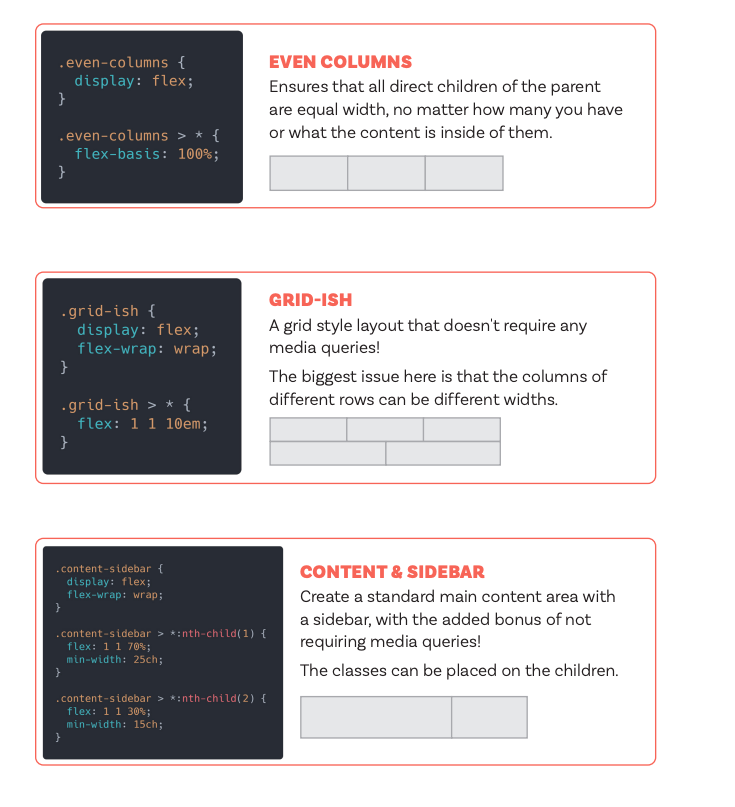

# Cross-browser compatible HTML/CSS markup

- Sometimes browsers don't support certain markups. We can use autoprefixer plugin to automatically add prefixes to those styling.

Link to autoprefixer: https://autoprefixer.github.io/

- Sometimes we can also use the @support rule. If browser supports a specific feature, then apply something.

```css

@supports not(backdrop-filter: blur()){
    h1 {
        background-color: hsl(0, 0%,100%,.8);
    }
}
```
Playwright is a useful library for testing across all browsers.


## Mobile Optimization

- Media queries

### Mobile First Approach

- Using min-width in the media queries, to make website responsive on larger screens.

Extra content: https://www.youtube.com/watch?v=K24lUqcT0Ms&ab_channel=SlayingTheDragon

### Advanced CSS Responsive Design Concepts

Link: https://www.youtube.com/watch?v=TUD1AWZVgQ8&t=123&ab_channel=WebDevSimplified

1. HTML meta tag (very important) - makes sure content stays in the device width
```html
<head>
    <meta name="viewport" content="width=device-width, initial-scale=1.0"/>
</head>
```
2. Media queries - not just widths, but orientations, aspect ratios and more.
3. @container query - gives us more control over responsiveness based on containers.

```scss
.main,
.sidebar {
  container-type: inline-size;
}

@container (width >= 400px){
  .box{
    background: red;
  }
}
```
4. Custom media query - ```@custom-media --small (width >= 400px)```
5. When designs are drastically different on large screen vs. smaller screens, we can have 2 different HTMLs, with specific classes. This makes us not use media queries.
6. Using `grid` and it's `grid-template-columns/rows` with `auto/minmax`
7. Using `min-width` and `max-width` but with `width: clamp(300px, 75%, 500px)`. This can be used in font-sizes too. 

### Progressive Enchantment

### Graceful Degradation


## Design Patterns

### Flexbox

- Even columns: Flexbox items tend to shrink as much as they can. To avoid this, we can use ```flex-basis: 100%```
on all direct children. Basis says you all want to be the same size.
- Grid-ish: ```flex: 1 1 33%``` on all direct children. Then ```flex-wrap: wrap``` on parent. This is useful to create a flex, that will in this case have 3 columns (because of the 33%) and if for example the fourth and fifth don't fit, they will be in a second row, taking up the whole row (because `flex-grow` is 1). And this is responsive.
- Content and sidebar: Parent is flex, `flex-wrap:wrap`. We select the content, give it `flex: 1 1 70%`. Then on the other element (sidebar) we put `flex: 1 1 70%`. To have more control on this, on the content area, we want to prevent it to get too small. We add a `min-width: 30ch` (ch - unit based on font size), or another number, you have to play around with it. We also put a `min-widht` to the other element as well.



Extra content: https://www.youtube.com/watch?v=vQAvjof1oe4&ab_channel=KevinPowell

# Optimisation of images

- We can use different tools to compress our images. 2.6mb is too big, we need a much smaller image, for example 401kb.
- Image formats are also important. For example, `.webp` which is a really highly optimised format. Sometimes change formats from `.jpg` to `.webp` is good in optimisation. Also, `svgs`.

Extra content: https://www.youtube.com/watch?v=pfHG6HL1GBw&ab_channel=JamesQQuick


## Extra content:

https://www.youtube.com/watch?v=adEwlFHLWd4&ab_channel=CodinginPublic
https://www.youtube.com/watch?v=9tEixRJ3GeI&ab_channel=KevinPowell