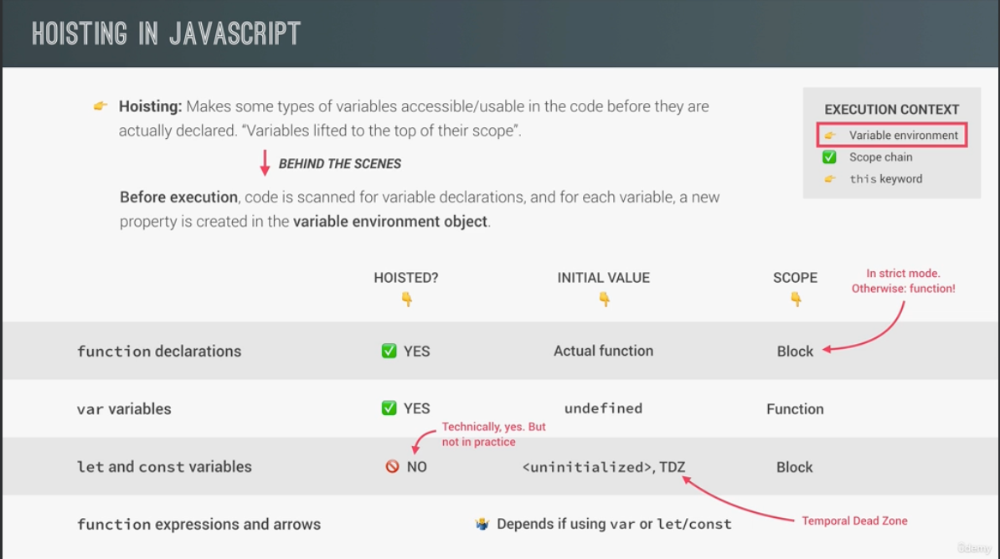
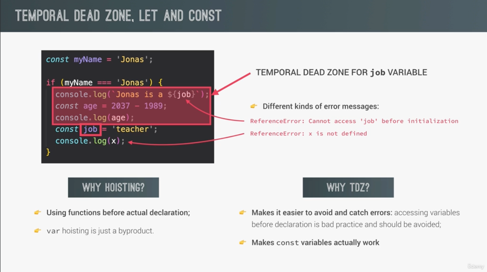
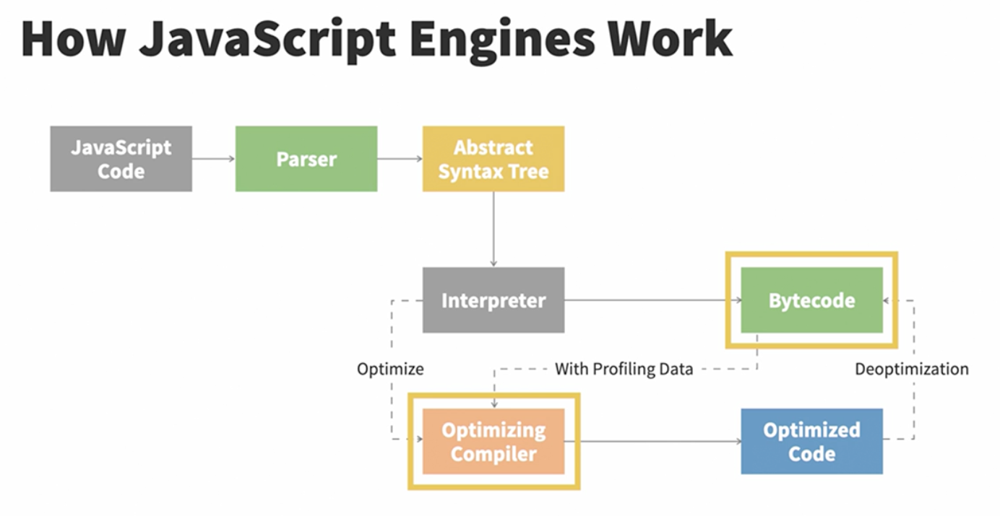
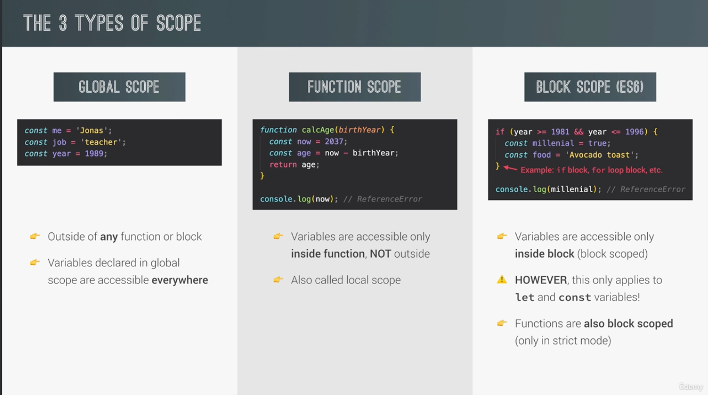
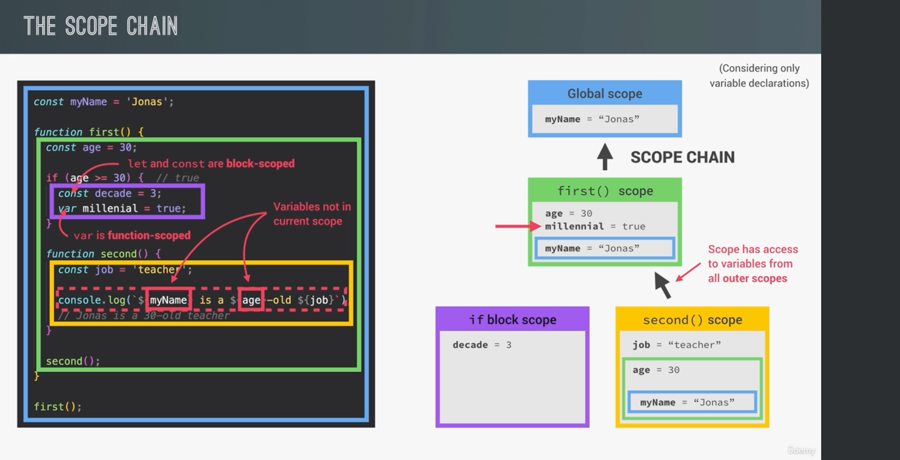
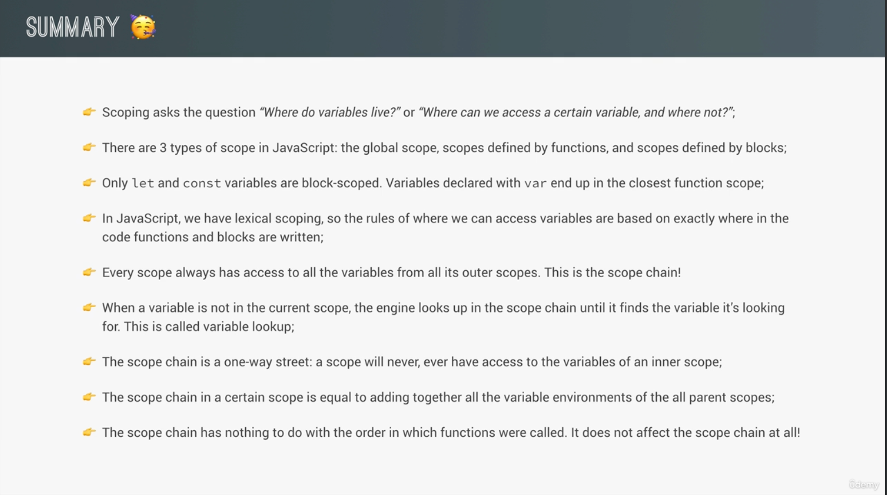

# JavaScript Execution Context

- Contains the code that is currently running and everything that aids its execution.

### Lexical Environment

- Simple object that contains the Outer Environmental Reference and the Environment Record (envRec)


### Thread of execution

- JS executes the code line by line, which is the thread of execution. Its synchronous and a single-threaded language.

### Call Stack

- Stack is LIFO (last in first out). In the example, it goes through the code line by line, until it gets to a function invocation. Then it adds the functions to the call stack.

```javascript
function one() {
    return 1;
}

function two() {
    return one() + 1;
}

function three() {
    return two() + 1;
}

console.log(three());

/**** STACK ****/
//one
//two
//three
/**** STACK ****/
```

### Hoisting

- Makes some types of variables accessible/usable inthe code before they are actually declared. "Variables are lifted to the top of their scope"
- `Variable Object (VO)` is an object-like container created within an execution context. It stores the variables and function declarations defined.
- Variables declared with `let` and `const `keywords are store uninitialized
- Variables declared with `var` are stored with the default value undefined
- During the `execution phase`, we can invoke a function before we declare it, since we have a reference to the entire function in memory.
- The process of storing variables and function declarations in memory prior to execution of the code is known as hoisting.




### How JavaScript Engines Work



1. The Parser breaks down the code reading it line by line into multiple tokens and create NODES.
2. The engine uses 2 parsers (pre parser and parser). To reduce the time needed for loading a website, the engine tries not to parse the code that is not necessary right away.
3. The Pre-Parser handles code that may be used later on while parser handles code that is needed right away.
   - Example: clicking a button, that code is not needed to load the website. So it's in the pre parser, which send the code to the parser only if the button is clicked.
4. With the nodes, it creates an `Abstract Syntax Tree` (AST) which is a tree representation of the source code of a computer program.
5. The `interpreter` walks through the AST and generates `bytecode`.
6. Once the `bytecode` gets generated fully, the `AST` is deleted, clearing up memory space.
7. `Bytecode` is fast, but it can be faster. As the `bytecode` runs, information is being generated. It can detect if a certain operation happens often and the types of data that's been used.
   - Example: you invoked a function dozen of times. We can optimize that to run even faster. 
8. The `bytecode` and `type feedback` are sent to the `optimizing compiler`, which generates highly optimized `machine code`.
9. In order to reduce the time it takes to interpret the code, optimized machine code only handles cases the engine has seen before running the byte code. If we repeatedly use the same piece of code that is returned with the same data type over and over again,
the optimized machine code can simply be reused in order to speed things up. However, since JS is dynamically typed, it can happen that the same piece of code suddenly returns a different type of data. If that happens, the machine code gets de-optimized. 

### Interpreter vs. Compiler

- Interpreted language - source code is read and directly executed line by line.
- Compile language - source file will be first compiled in machine code or byte code, before being executed.

**What is better?**

- Interpreters are quick to get up and running. You don't have to go through the whole compilation step before running your code. But, what if you run the same code over and over again? If you are in a loop you have to do the same translation over and over again. The compiler has the opposite tradeof. It needs more time to get going because of the compile process, but then the code in loops runs faster, because it doesn't have to do the translation for each pass of the loop.
- The Compiler also gets to look at the code and make edits so that it'll run faster. These edits are called optimization. The interpretor is doing its work during run time, so it doesn't have time to do these optimizations. 
- Is JavaScript Interpreted or Compiled? It uses best of both worlds and has developed the `Just-In-Time Model`.


### JUST IN TIME JIT

- Modern browsers have added a new part to the JS Engine called the `Monitor` or `Profiler`. It watches the code as it runs and makes a note how many times it is run, and what types are used. 
- At first the `monitor` just runs everything through the `interpreter`.  If the same line of code has run a few times, that segment of the code is called `warm`, if run a lot of times then `hot`.
- When a function starts getting `warm` the `JIT` sends it to the compiler to be compiled. Then stores that compilation.
- Each line of the function is complied to a stub. The stubs are indexed by line number and variable type. 
- If the `monitor` ses that the execution is hitting the same code again and again with the same variable types, it will pull out the compiled code.
- If the code is `hot` the `JS Engine` will try to do some optimizations to speed things up.
- The monitor will send it of to the `opimization compiler` and this will create another, even faster version of the function that will also be stored.
- An object that is used often in code, the `JS Engine` creates a shape for the specific object. 
- A shape is basically just a structure of what properties exist in that object. The shape contains pointers to the offsets on which we can find values of properties of that object.
- Shapes are useful for an optimization technique called `inline caching`. That is when results of the previous operations are stored so that the next time the engine needs to get the value of a property with the same shape, it just gets it from the cache, rather than doing an offset lookup each time.
- These inline caches also create some feedback for the optimizing compiler. This feedback is used to optimize the code and create machine code.

### Garbage Collector

- Purpose is to monitor memory allocation and determine when a block of allocated memory is no longer need and reclaim it. This process is automated in JS by the Browser.

1. Whenever a variable object or function is created, a memory space is allocted to it.
2. The allocated memory is used by means of read/write operations
3. When the memory is no longer needed it released the memory space -> this is the garbace collection part.

- Uses two algorithms `Reference Counting` and `Mark and Sweep`
- The reference counting relies on the fact that any object is referenced by any other object or variable. If not, then it is released from memory.
```javascript
var obj = {
    x: {
        y: 2
    }
}
// when the value of the outer object is changed to a single number, the inner object can be released
```
- Small problem in this. Sometimes objects can reference each other and we end up creating cycles.
```javascript
function check() {
    var bar = {};
    var foo = {};
    bar.name = foo;
    foo.name = bar;
    
    return true
    
}

check()

// even though  the variables are out of scope outside of the function they would still remain in memory as per the algorithm , because both of the objects have properties referencing each other
```
- This above is a common cause of memory leaks (Circular References)
- This is where `Mark and Sweep` comes in. This assumes the knowledge of the set of rules called `the root`. In Javascript, the root is the global object. Periodically, the `Garbage Collector` will start from this root object, find all the object that are referenced  from these roots, then all the objects referenced from those roots and so on. Starting from the root the GC will find all the reachable objects and collect all non-reachable objects.
- Looking at the above example, JS can easily track down the name of the object, since the hierarchy is well-defined. When the function call returns, the two objects are no longer referenced by any resource that is reachable from the global root object so their allocated memory will be reclaimed.


## Javascript Event Loop

- Memory heap - where data is stored in JavaScript, large and unstructured
- Call-Stack - responsible for keeping track of all operations in line to be executed
- Queue - responsible for sending new functions to the stack, FIFO

### Web APIs

- Helps us create non-synchronous behavior. Not part of JavaScript but rather built on top of it.

- DOM API - allow us to manipulate DOM elements, html and css.
- FETCH API - used to fetch data from the server
- CANVAS - drawing, update pixel data in HTML elements, create 2d and 3d shapes
- Audio and video APIs - do interesting things with multimedia
- Storage APIs - store data on the client side (sessionStorage, localStorage)
- setTimeout, setInterval
- HTTP Requests

### Event Loop

- The setTimeout gets added to the call stack, JS recognizes that it has to wait a certain amount of time before running its callback and to free up JS thread, it gets transferred to the Web API thread.
- Two different `queue` - Microtask and Macrotask.
- In the Web API a timer runs that is as long as the setTimeouts timer. The callback doesn't get added back to the stack right away, but instead goes to the `queue`. This means the function has to wait for its turn. Once the call stack is empty, the first item from the queue gets added to the call stack. 
- `setTimeout`, `setCallback`, etc.. get added to the `Macrotask Queue`. 
- `Promise` callbacks, `then` and `catch` methods, get added to the `Microtask Queue`.
- `Microtask` queue has priority of execution.


### Extra info about JS

- Multi-paradigm language - means that it supports procedural, OOP and Function Programing.
- First class functions - means that functions are treated as variables. We can pass them to other functions and a function can return a function.
- Dynamically typed language - we don't assign types to variables, they only get known once the JS Engine runs our code.
-  JS Engine - a computer program that runs the JS code. Most popular one is V8 from Google, that also can run Node JS.


- Link to content: https://www.linkedin.com/learning/javascript-under-the-hood/garbage-collector-in-javascript?autoSkip=true&dApp=53239054&leis=LAA&resume=false&u=2113185


# Udemy Course

### How does execution happen? 

1. After compilation, when the code is ready to be executed, a `global execution` context is created. This is a place where all variables are stored that are necessary to run the code.
2. Then the execution of top level code happens.
3. For each function, a new execution context is created with all the necessary information to run it.

### Whats inside of the Global Execution Context?

1. Variable environment - all variables, functions, argument objects
2. Scope Chain - consists of references to variables that are located outside the current context
3. this keyword

- IMPORTANT: Arrow functions don't have the `argument object` and the `this` keyword
- All this gets generated in the `Creation Phase` that happens right before the `Executuion Phase`

### Scope and Scope Chain

- Where do variables live? How to access them? How the programs variables are organized and accessed? 
- Lexical scoping - scoping is controlled by placement of functions and blocks in the code
- Scope - space or environment a certain variable is declared. There are `global`, `function` and `block` scope.
- Scope of a variable - region of our code where a certain variable can be accessed





- Note: purple block (block scope) doesn't have access to the yellow (functional) and vice versa because of lexical scoping. Siblings never have access to each other, just their parent.


